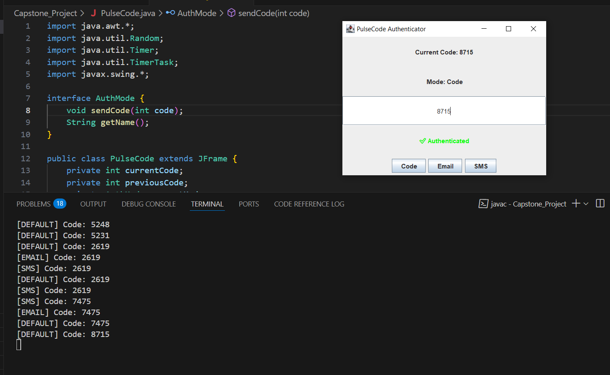

# Multi-Mode Authentication System using Java OOP Concepts

## 🎯 Objective
Implement a secure, extensible, and reusable authentication system in Java using object-oriented principles like abstraction, interfaces, inheritance, and polymorphism. The system generates time-based OTPs and supports multiple delivery modes like Console, Email, and SMS.

---

## 🔧 System Overview
This system simulates a two-factor authentication mechanism with the following features:

- 🔁 OTP generation every 10 seconds.
- ✅ OTP validation with fallback to previous code (for delay tolerance).
- 🔄 Dynamic switching between authentication modes.

---

## 🧱 Class Structure

### 1. `DefaultCodeGenerator`
- **Purpose:** Generates 6-digit OTPs.
- **Key Method:** `generate()` → Returns a random 6-digit number.

### 2. `AuthMode` (Interface)
- Defines behavior for all auth delivery modes.
- Methods:
  - `void sendCode(int code)`
  - `String getName()`

### 3. `ConsoleAuthMode`, `EmailAuthMode`, `SmsAuthMode`
- Implements `AuthMode`
- **Purpose:** Mode-specific delivery behavior.
- **Working:**
  - `sendCode()` → Simulates delivery using `System.out`
  - `getName()` → Returns mode name

### 4. `InvalidCodeException`
- Custom exception for invalid OTP input.
- Constructor: `InvalidCodeException(String message)`

### 5. `Authenticator`
- **Fields:**
  - `current`, `prev` → stores OTPs
  - `defaultMode`, `currentMode`
- **Methods:**
  - `generateAndSendCode()` → Generates and sends OTP
  - `getCurrentCode()` → Returns current OTP
  - `validate(int code)` → Validates OTP input
  - `sendCodeVia(AuthMode mode)` → Switches mode temporarily

### 6. `PStuffAuthenticator` (Main Class)
- Entry point. Handles:
  - Mode selection
  - OTP verification
  - Launches refresher thread every 10s

---

## 🔁 Execution Flow

```text
1. Starts with Console mode.
2. Every 10s, generates a new OTP.
3. Accepts user input for OTP or mode.
4. Validates OTP (current or previous).
5. Stops after successful authentication.
```

---

## 💻 Output


---

## 🧠 OOP Concepts Demonstrated

| Concept           | Description |
|------------------|-------------|
| **Abstraction**   | OTP generation and mode logic via interfaces/classes |
| **Encapsulation** | Authenticator wraps internal state and logic         |
| **Polymorphism**  | Interface `AuthMode` used to switch between modes    |
| **Inheritance**   | Extendable via new mode classes (e.g., WhatsApp)     |
| **Multithreading**| Background thread for OTP refreshing                 |
| **Thread Safety** | Synchronized methods in Authenticator                |
| **Modularity**    | Separate classes for generation, delivery, and logic |
| **Custom Exception** | `InvalidCodeException` for invalid OTP handling  |

---

## 🚀 Future Scope

- ✅ Integrate real Email/SMS APIs (e.g., Twilio, SMTP)
- ✅ Add UI via JavaFX or Web Frontend
- ✅ Add database with timestamps and token expiry
- ✅ Add retry limits and lockouts
- ✅ Add new `WhatsAppMode`, `PushNotificationMode`
- ✅ Refactor with abstract base class for common logic

---

## 📁 Code

The full code is available in [`PStuffAuthenticator.java`](PulseCode.java)
