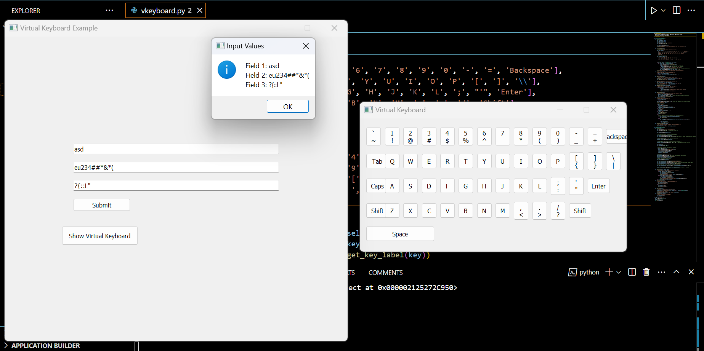

# Virtual Keyboard Application

## Overview

This project implements a virtual keyboard using PyQt5. It provides a fully interactive virtual keyboard with support for Shift, Caps Lock, and special keys like Backspace, Space, and Enter. The virtual keyboard can be used to enter text into multiple input fields on the main window.

## Features

- A fully functional virtual keyboard with all alphabetic, numeric, and special characters.
- Support for Caps Lock and Shift functionality for toggling between uppercase and lowercase letters.
- Spacebar, Backspace, Enter, and Tab keys to simulate real typing.
- The virtual keyboard can be toggled on and off.
- The virtual keyboard can be used in any text input field (QLineEdit) within the application.

## Installation

### Prerequisites

Make sure you have Python 3.x installed. You will also need to install PyQt5.

1. Install PyQt5 using pip:
    ```bash
    pip install pyqt5
    ```

### Running the Application

1. Clone the repository or download the code to your local machine.
2. Run the script using the following command:
    ```bash
    python virtual_keyboard.py
    ```

3. The application will open a window with input fields and a "Show Virtual Keyboard" button. Click this button to display the virtual keyboard.

## How It Works

### Virtual Keyboard Class

- The `VirtualKeyboard` class is the core of the application. It manages the layout of the virtual keyboard and handles the input from the user.
- Keys are displayed using buttons, with each button mapped to a character or special function.
- The virtual keyboard supports Caps Lock and Shift functionality. The behavior of each key changes depending on whether Shift or Caps Lock is active.

### Main Window Class

- The `MainWindow` class is the main GUI of the application, which contains input fields and a button to toggle the visibility of the virtual keyboard.
- The `QLineEdit` fields allow the user to enter text. When an input field gains focus, the virtual keyboard is displayed automatically.
- A submit button is provided to display the entered values.

### Key Mapping

The keyboard layout is created as a grid, with buttons mapped to the following rows:

1. Row 1: '`', '1', '2', '3', '4', '5', '6', '7', '8', '9', '0', '-', '=', 'Backspace'
2. Row 2: 'Tab', 'Q', 'W', 'E', 'R', 'T', 'Y', 'U', 'I', 'O', 'P', '[', ']', '\\'
3. Row 3: 'Caps', 'A', 'S', 'D', 'F', 'G', 'H', 'J', 'K', 'L', ';', "'", 'Enter'
4. Row 4: 'Shift', 'Z', 'X', 'C', 'V', 'B', 'N', 'M', ',', '.', '/', 'Shift'
5. Row 5: 'Space'

Special characters are mapped to the secondary symbols dictionary and appear when the Shift key is pressed.

## Key Functions

- **Shift:** Toggles between lowercase and uppercase letters for the corresponding keys.
- **Caps Lock:** Activates or deactivates the Caps Lock functionality.
- **Backspace:** Deletes the last character entered.
- **Tab:** Inserts a tab space.
- **Enter:** Submits the current input or hides the virtual keyboard.
- **Space:** Inserts a space character.

## Usage

1. Enter text in the input fields.
2. Click on any key of the virtual keyboard to insert the corresponding character.
3. Use the Shift or Caps Lock keys to modify the case of letters.
4. Press Backspace to delete the last character.
5. Press Enter to submit the text.

## Screenshot



## Future Enhancements

- Add support for numerical keypad and function keys.
- Improve the layout for better accessibility.
- Implement language-specific keyboards.

## Contributing

If you would like to contribute to this project, feel free to fork the repository and submit pull requests. Any improvements or bug fixes are welcome!

## License

This project is licensed under the MIT License - see the [LICENSE](LICENSE) file for details.
